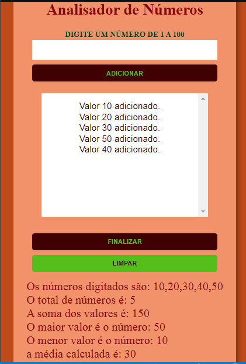

## Bem Vindo!

Obrigada por visitar o Analisador de Números, o desafio é criar um analisador em que o cliente possa 
digitar um número de 1 a 100.

O analisador será capaz de retornar:

- Os valores digitados em ordem crescente.
- A quantidade de números digitados.
- A soma de todos os números.
- O maior e o menor número.
- A média entre os números.

## Propósito do desafio

O propósito principal de fazer esse desafio é treinar o uso de arrays e funções. 

No desafio original eram implementadas a função de verificar se o valor digitado era um número,
outra função de verificar se este número já havia sido digitado e uma última função de adicionar o valor digitado
caso atendesse as condições das funções anteriores.

Além dessas funções criei um novo botão de limpar, e fiz uma função atrelada a ele.
Onde ao ser clicado ele apaga os valores contidos no array, limpa o select e limpa a div em que aparece os resultados.

Assim, o cliente não precisa recarregar a  página.
Outra função que criei foi adicionar um evento para que a tecla enter possa ser usada, sem
a necessidade de clicar com o mouse no botão de adicionar, sendo assim uma segunda opção.

## Linguagens utilizadas

- Linguagem de marcação HTML.
- Folhas de Estilo em Cascata CSS.
- Linguagem de programação JavaScript.

## Estilização

Comecei a estilização pela parte mobile primeiro, continuarei estilizando para desktop.

## Considerações Finais

Foi um prazer fazer esse desafio, pois estou iniciando no mundo JavaScript, e assim
pude aprimorar meus conhecimentos.

Para acessar o resultado segue o link abaixo:
- [GitHub Pages](https://crisleine-erculano.github.io/analisador-de-numeros/)

Contato:
- [Linkedin](https://www.linkedin.com/in/crisleine-erculano).

